Cluster Analysis
================
Nadia Noui-Mehidi

In this project I perform an exploratory data analysis on clustering
problems. The project is divided into three sections, each focusing on a
different dataset and cluster analysis technique. This project includes
applications of hierarchical cluster analysis, k-means cluster analysis,
the integration of principal components analysis and cluster analysis,
and the application of cluster analysis as a predictive model.

# European Employment Data

The first section of this project focuses on the European Employment
dataset, a datsetset showing the percentage employed in different
industries in Europe countries during 1979. I use multivariate
techniques, such as cluster analysis and principal components analysis
to gain insight into patterns of employment (if any) amongst European
countries. All of the 30 countries in the dataset belong to one of three
EU groups – EU for the European Union, EFTA for the European Free Trade
Association, Eastern for the Eastern European nations and other. Other
consists of four countries – Cyprus, Gibraltar, Malta and Turkey which
we could think of as the Mediterranean region.

``` r
#"/Users/nadianoui-mehidi/Cluster-Analysis"
#dir.create("raw_data")
#file.copy("~/Documents/EuropeanEmployment.csv", "raw_data")
```

``` r
library(readr)
employment <- read.csv("raw_data/EuropeanEmployment.csv")
print(employment)
```

    ##           Country   Group  AGR  MIN  MAN  PS  CON  SER  FIN  SPS  TC
    ## 1         Belgium      EU  2.6  0.2 20.8 0.8  6.3 16.9  8.7 36.9 6.8
    ## 2         Denmark      EU  5.6  0.1 20.4 0.7  6.4 14.5  9.1 36.3 7.0
    ## 3          France      EU  5.1  0.3 20.2 0.9  7.1 16.7 10.2 33.1 6.4
    ## 4         Germany      EU  3.2  0.7 24.8 1.0  9.4 17.2  9.6 28.4 5.6
    ## 5          Greece      EU 22.2  0.5 19.2 1.0  6.8 18.2  5.3 19.8 6.9
    ## 6         Ireland      EU 13.8  0.6 19.8 1.2  7.1 17.8  8.4 25.5 5.8
    ## 7           Italy      EU  8.4  1.1 21.9 0.0  9.1 21.6  4.6 28.0 5.3
    ## 8      Luxembourg      EU  3.3  0.1 19.6 0.7  9.9 21.2  8.7 29.6 6.8
    ## 9     Netherlands      EU  4.2  0.1 19.2 0.7  0.6 18.5 11.5 38.3 6.8
    ## 10       Portugal      EU 11.5  0.5 23.6 0.7  8.2 19.8  6.3 24.6 4.8
    ## 11          Spain      EU  9.9  0.5 21.1 0.6  9.5 20.1  5.9 26.7 5.8
    ## 12             UK      EU  2.2  0.7 21.3 1.2  7.0 20.2 12.4 28.4 6.5
    ## 13        Austria    EFTA  7.4  0.3 26.9 1.2  8.5 19.1  6.7 23.3 6.4
    ## 14        Finland    EFTA  8.5  0.2 19.3 1.2  6.8 14.6  8.6 33.2 7.5
    ## 15        Iceland    EFTA 10.5  0.0 18.7 0.9 10.0 14.5  8.0 30.7 6.7
    ## 16         Norway    EFTA  5.8  1.1 14.6 1.1  6.5 17.6  7.6 37.5 8.1
    ## 17         Sweden    EFTA  3.2  0.3 19.0 0.8  6.4 14.2  9.4 39.5 7.2
    ## 18    Switzerland    EFTA  5.6  0.0 24.7 0.0  9.2 20.5 10.7 23.1 6.2
    ## 19        Albania Eastern 55.5 19.4  0.0 0.0  3.4  3.3 15.3  0.0 3.0
    ## 20       Bulgaria Eastern 19.0  0.0 35.0 0.0  6.7  9.4  1.5 20.9 7.5
    ## 21 Czech/Slovakia Eastern 12.8 37.3  0.0 0.0  8.4 10.2  1.6 22.9 6.9
    ## 22        Hungary Eastern 15.3 28.9  0.0 0.0  6.4 13.3  0.0 27.3 8.8
    ## 23         Poland Eastern 23.6  3.9 24.1 0.9  6.3 10.3  1.3 24.5 5.2
    ## 24        Romania Eastern 22.0  2.6 37.9 2.0  5.8  6.9  0.6 15.3 6.8
    ## 25          USSRF Eastern 18.5  0.0 28.8 0.0 10.2  7.9  0.6 25.6 8.4
    ## 26    YugoslaviaF Eastern  5.0  2.2 38.7 2.2  8.1 13.8  3.1 19.1 7.8
    ## 27         Cyprus   Other 13.5  0.3 19.0 0.5  9.1 23.7  6.7 21.2 6.0
    ## 28      Gibraltar   Other  0.0  0.0  6.8 2.0 16.9 24.5 10.8 34.0 5.0
    ## 29          Malta   Other  2.6  0.6 27.9 1.5  4.6 10.2  3.9 41.6 7.2
    ## 30         Turkey   Other 44.8  0.9 15.3 0.2  5.2 12.4  2.4 14.5 4.4

## Initial Exploratory Data Analysis:

When we have multivariate data, the scatterplot of each pair of
variables can be used as the basis of an initial examination of the the
data for informal evidence of cluster structure. Using the pairs plot
below to scan the individual 2-dimensional views of the data we see that
some industries move together. Agriculture has negative correlation with
Service, Construction, and Manufacturing industries. Transport,
manufacturing and construction are also correlated

``` r
#Pairwise Scatterplot

pairs(employment[,-c(1,2)])
```

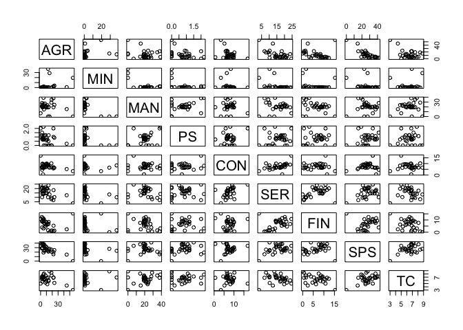<!-- -->

## Visualizing the Data with Labelled Scatterplots:

While the pairs plot allows us to scan all pairwise scatterplots, it is
not the ideal visualization of the data. After we have honed in on some
interesting dimensions we can create more specialized plots for those
dimensions to see whether they reveal any clusters.

### Scatterplot of Financial versus Service Industries.

It looks like the EFTA and EU countries are close together and tend
towards the top right of the graph, with participation in service and
financial industries. The countries that fall into the “Eastern” and
“other” categories are grouped to the bottom left of the graph
indicating lower participation in service and financial industries .
Albania stands out as an outlier.

``` r
ggplot(employment, aes(x=SER, y=FIN, colour = Group, label= Country)) +geom_point() + geom_text(aes(label=Country),hjust=0, vjust=0) +ggtitle("Scatter Plot Financial vs Services") +theme(plot.title=element_text(lineheight=0.8, face="bold", hjust=0.5))
```

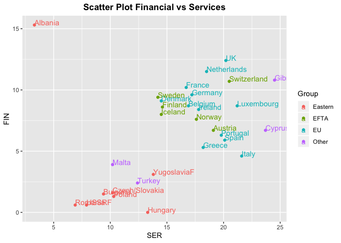<!-- -->

### Scatterplot of Manufacturing versus Service Industries.

It looks like there is one cluster in the center of the graph made up of
the EU and EFTA countries. The countries that fall into the “Eastern”
and “other” categories are randomly scattered around the graph and
exhibit no clustering pattern.

``` r
ggplot(employment, aes(x=MAN, y=FIN, colour = Group, label= Country)) +geom_point() + geom_text(aes(label=Country),hjust=0, vjust=0) +ggtitle("Scatter Plot Financial vs Manufacturing") +theme(plot.title=element_text(lineheight=0.8, face="bold", hjust=0.5))
```

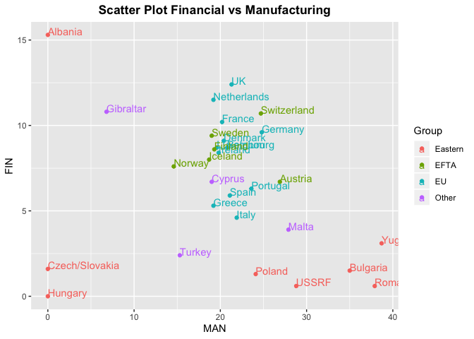<!-- -->

The scatterplot of Financial versus Service Industries gave us a better
view of the way the countries cluster, while there arent four distinct
clusters, we have two distinct clusters. The EFTA and EU countries are
well differenciated from the Other and Eastern countries when it comes
to Service and FInancial industry participation.

## 3\. Projecting our Data in a 2d Coordinate System Using Principal Components Analysis

Scatterplots may be more useful after the data has been projected onto a
two dimensional coordinate system in a way that preserves their
multivariate structure as fully of possible.

### PCA on Raw Data

A scatterplot of our data plotted on a coordinate system made up of the
first 2 principal components is below. The EU and EFTA countries have
formed a tighter cluster than before. The countries that are grouped in
the Eastern and “oter” categories are still randomly dispersed on the
coordinate system. Albania is still a clear outlier. Its interesting
that EU and EFTA are consistently forming a cluster, maybe countries
with trade agreements have similar industry composition.

``` r
apply(employment[,-c(1,2)],MARGIN=1,FUN=sum)
```

    ##  [1] 100.0 100.1 100.0  99.9  99.9 100.0 100.0  99.9  99.9 100.0 100.1
    ## [12]  99.9  99.8  99.9 100.0  99.9 100.0 100.0  99.9 100.0 100.1 100.0
    ## [23] 100.1  99.9 100.0 100.0 100.0 100.0 100.1 100.1

``` r
pca.out <- princomp(x=employment[,-c(1,2)],cor=FALSE);
names(pca.out)
```

    ## [1] "sdev"     "loadings" "center"   "scale"    "n.obs"    "scores"  
    ## [7] "call"

``` r
pc.1 <- pca.out$scores[,1];
pc.2 <- pca.out$scores[,2];
str(pc.1)
```

    ##  num [1:30] -13.24 -10.22 -9.49 -9.99 9.63 ...

``` r
pcdf = data.frame(pc1=pc.1, pc2=pc.2)
pcdf1 = cbind(pcdf,employment$Country)
pcdf2 = cbind(pcdf1,employment$Group)
str(pcdf2)
```

    ## 'data.frame':    30 obs. of  4 variables:
    ##  $ pc1               : num  -13.24 -10.22 -9.49 -9.99 9.63 ...
    ##  $ pc2               : num  -3.87 -2.85 -2.62 1.24 5.73 ...
    ##  $ employment$Country: Factor w/ 30 levels "Albania","Austria",..: 3 7 9 10 12 15 16 17 19 22 ...
    ##  $ employment$Group  : Factor w/ 4 levels "Eastern","EFTA",..: 3 3 3 3 3 3 3 3 3 3 ...

``` r
ggplot(pcdf2, aes(x=pc1, y=pc2, colour = employment$Group, label= employment$Country)) + 
  geom_point() + geom_text(aes(label=employment$Country),hjust=0, vjust=0) +
  ggtitle("Scatter Plot PC1 vs PC2") +
  theme(plot.title=element_text(lineheight=0.8, face="bold", hjust=0.5))
```

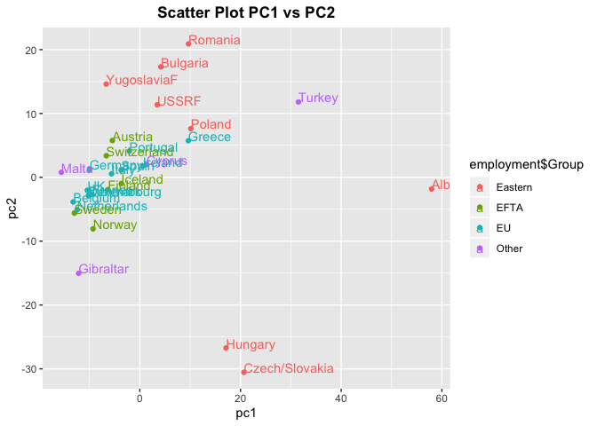<!-- -->

### PCA with scaled data

Usually we want to scale our data before we use a principal component
analysis. In this case, since the variables are composite, and are all
measured using the same units we dont need to scale the data ahead of
time. Nonetheless, we will try scaling the data before using PCA to see
if that makes a differen in our cluster patterns. In the scatterplot
below, the cluster patterns are not much different than the unscaled
version. We still have one tight cluster made up of the EU and EFTA
countries.

``` r
e<-employment[,-c(1,2)]
employment.scaled <- scale(e)
apply(employment.scaled[,-c(1,2)],MARGIN=1,FUN=sum)
```

    ##  [1]   1.7788676   1.3407796   1.7471882   1.9957254  -0.3633977
    ##  [6]   0.5928995  -0.7217969   2.8054189   0.5358013  -0.4611053
    ## [11]   0.5982157   3.0830313   1.9159627   2.1204403   1.6398499
    ## [16]   2.6620737   1.8995303   1.0963578 -11.0570007  -2.3858960
    ## [21]  -5.5422479  -4.0302131  -3.5636471  -1.1065068  -1.0093907
    ## [26]   3.3519637   0.4993582   6.3175755   1.3951810  -7.1350185

``` r
pca <- princomp(x=employment.scaled[,-c(1,2)],cor=FALSE);
names(pca)
```

    ## [1] "sdev"     "loadings" "center"   "scale"    "n.obs"    "scores"  
    ## [7] "call"

``` r
pc.1 <- pca$scores[,1];
pc.2 <- pca$scores[,2];
str(pc.1)
```

    ##  num [1:30] 0.728 0.424 0.698 0.788 -0.157 ...

``` r
pcdf = data.frame(pc1=pc.1, pc2=pc.2)
pcdf1 = cbind(pcdf,employment$Country)
pcdf2 = cbind(pcdf1,employment$Group)
str(pcdf2)
```

    ## 'data.frame':    30 obs. of  4 variables:
    ##  $ pc1               : num  0.728 0.424 0.698 0.788 -0.157 ...
    ##  $ pc2               : num  0.143 0.235 -0.342 -0.616 0.144 ...
    ##  $ employment$Country: Factor w/ 30 levels "Albania","Austria",..: 3 7 9 10 12 15 16 17 19 22 ...
    ##  $ employment$Group  : Factor w/ 4 levels "Eastern","EFTA",..: 3 3 3 3 3 3 3 3 3 3 ...

``` r
ggplot(pcdf2, aes(x=pc1, y=pc2, colour = employment$Group, label= employment$Country)) + 
  geom_point() + geom_text(aes(label=employment$Country),hjust=0, vjust=0) +
  ggtitle("Scatter Plot PC1 vs PC2") +
  theme(plot.title=element_text(lineheight=0.8, face="bold", hjust=0.5))
```

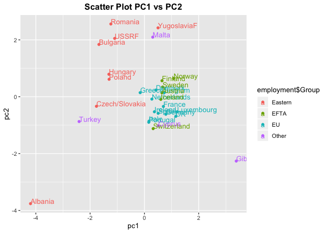<!-- -->

## Hierarchical Clustering Analysis

In agglomerative hierarchical clustering, each observation starts as its
own cluster. Clusters are then combined (two at a time) until all
clusters are merged into a single cluster. Clusters are combined based
on their proximity to one another; we will use Complete Linkage and
Euclidian Distance to measure this proximity. Complete linkage
clustering, measures the longest distance between a point in one cluster
and a point in the other cluster. Because these variables all use the
same units we do not standardize the data before calculating Euclidian
distances and performing the complete linkage clustering. We visualize
our hierarchic classifications using a dendrogram, which illustrates how
items are combined into clusters. The dendogram helps us understand
which countries are similar or different with regard to their Industry
composition.

In the dendogram below, our countries for the most part tend to cluster
in a way that aligns with their EU groups. Eastern European countries
look like they tend to be together, members of the EU seems to be
grouped together, EFTA looks like its in its own cluster (Far right).
Malta and Gibraltar look like outliers, theyre both small islands and
probably dont have the diversity of economy to naturally fall into any
of the clusters.

``` r
hier.dist = dist(employment[,-c(1,2)])

hclustmodel <- hclust(hier.dist, method = 'complete')
plot(hclustmodel,labels=employment$Country)
```

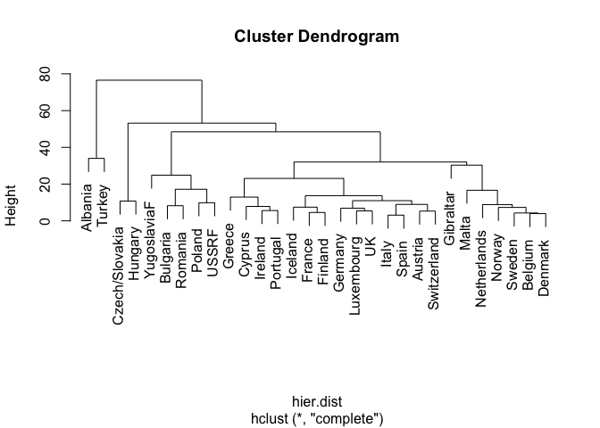<!-- -->

#### Hierarchical Cluster Analysis: 3 clusters

Now we use the cutree() function to force an assignment of the
observations to 3 clusters. The dendrogram is replotted, and the
rect.hclust() function is used to superimpose the three-cluster
solution. The results are displayed below. Our 3-cluster cut off results
in one main cluster containing all the countries and then two clusters,
one for each of the two outlier countries (Albania and Gilbraltar).
Complete linkage clustering is sensitive to outliers so to improve our
cluster results we could either remove the outliers or try again with
more clusters.

``` r
plot(hclustmodel,labels=employment$Country)
rect.hclust(hclustmodel,k=3,border = 2:5)
```

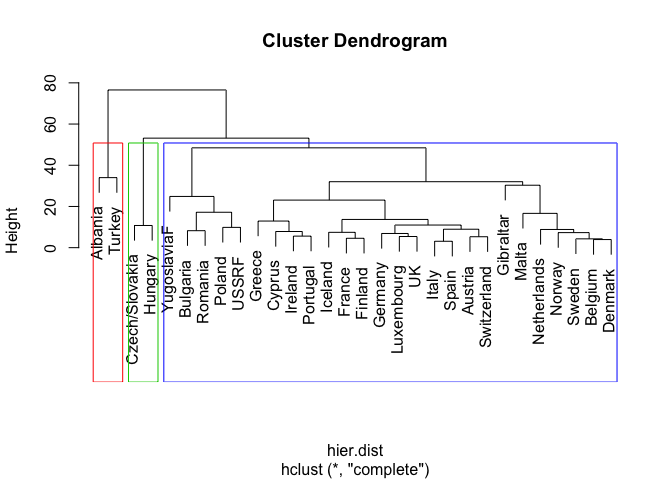<!-- -->

To get an idea of the classification accuracy of our clusters we create
a table showing us how the EU group members are grouped by our solution.
The rows denote the cluster solution and the columns denote the EU
group. All of our groups are most heavily loaded to cluster 1 while a
couple countries are clustered into 2 and 3. We may need to use more
clusters to break up cluster 1.

``` r
# choose the number of clusters k = 3
cut.3 <- cutree(hclustmodel, k=3)
edata<-cbind.data.frame(employment,cut.3)
edata
```

    ##           Country   Group  AGR  MIN  MAN  PS  CON  SER  FIN  SPS  TC cut.3
    ## 1         Belgium      EU  2.6  0.2 20.8 0.8  6.3 16.9  8.7 36.9 6.8     1
    ## 2         Denmark      EU  5.6  0.1 20.4 0.7  6.4 14.5  9.1 36.3 7.0     1
    ## 3          France      EU  5.1  0.3 20.2 0.9  7.1 16.7 10.2 33.1 6.4     1
    ## 4         Germany      EU  3.2  0.7 24.8 1.0  9.4 17.2  9.6 28.4 5.6     1
    ## 5          Greece      EU 22.2  0.5 19.2 1.0  6.8 18.2  5.3 19.8 6.9     1
    ## 6         Ireland      EU 13.8  0.6 19.8 1.2  7.1 17.8  8.4 25.5 5.8     1
    ## 7           Italy      EU  8.4  1.1 21.9 0.0  9.1 21.6  4.6 28.0 5.3     1
    ## 8      Luxembourg      EU  3.3  0.1 19.6 0.7  9.9 21.2  8.7 29.6 6.8     1
    ## 9     Netherlands      EU  4.2  0.1 19.2 0.7  0.6 18.5 11.5 38.3 6.8     1
    ## 10       Portugal      EU 11.5  0.5 23.6 0.7  8.2 19.8  6.3 24.6 4.8     1
    ## 11          Spain      EU  9.9  0.5 21.1 0.6  9.5 20.1  5.9 26.7 5.8     1
    ## 12             UK      EU  2.2  0.7 21.3 1.2  7.0 20.2 12.4 28.4 6.5     1
    ## 13        Austria    EFTA  7.4  0.3 26.9 1.2  8.5 19.1  6.7 23.3 6.4     1
    ## 14        Finland    EFTA  8.5  0.2 19.3 1.2  6.8 14.6  8.6 33.2 7.5     1
    ## 15        Iceland    EFTA 10.5  0.0 18.7 0.9 10.0 14.5  8.0 30.7 6.7     1
    ## 16         Norway    EFTA  5.8  1.1 14.6 1.1  6.5 17.6  7.6 37.5 8.1     1
    ## 17         Sweden    EFTA  3.2  0.3 19.0 0.8  6.4 14.2  9.4 39.5 7.2     1
    ## 18    Switzerland    EFTA  5.6  0.0 24.7 0.0  9.2 20.5 10.7 23.1 6.2     1
    ## 19        Albania Eastern 55.5 19.4  0.0 0.0  3.4  3.3 15.3  0.0 3.0     2
    ## 20       Bulgaria Eastern 19.0  0.0 35.0 0.0  6.7  9.4  1.5 20.9 7.5     1
    ## 21 Czech/Slovakia Eastern 12.8 37.3  0.0 0.0  8.4 10.2  1.6 22.9 6.9     3
    ## 22        Hungary Eastern 15.3 28.9  0.0 0.0  6.4 13.3  0.0 27.3 8.8     3
    ## 23         Poland Eastern 23.6  3.9 24.1 0.9  6.3 10.3  1.3 24.5 5.2     1
    ## 24        Romania Eastern 22.0  2.6 37.9 2.0  5.8  6.9  0.6 15.3 6.8     1
    ## 25          USSRF Eastern 18.5  0.0 28.8 0.0 10.2  7.9  0.6 25.6 8.4     1
    ## 26    YugoslaviaF Eastern  5.0  2.2 38.7 2.2  8.1 13.8  3.1 19.1 7.8     1
    ## 27         Cyprus   Other 13.5  0.3 19.0 0.5  9.1 23.7  6.7 21.2 6.0     1
    ## 28      Gibraltar   Other  0.0  0.0  6.8 2.0 16.9 24.5 10.8 34.0 5.0     1
    ## 29          Malta   Other  2.6  0.6 27.9 1.5  4.6 10.2  3.9 41.6 7.2     1
    ## 30         Turkey   Other 44.8  0.9 15.3 0.2  5.2 12.4  2.4 14.5 4.4     2

``` r
table(edata$Group, edata$cut.3)
```

    ##          
    ##            1  2  3
    ##   Eastern  5  1  2
    ##   EFTA     6  0  0
    ##   EU      12  0  0
    ##   Other    3  1  0

#### Hierarchical Cluster Analysis: 6 clusters

We use the cutree() function to force an assignment of the observations
to 6 clusters. The dendrogram is replotted, and the rect.hclust()
function is used to superimpose the six-cluster solution. At a cut off
of 6, our clusters more closely align with the groupings in our original
dataset. Eastern Europe is confined to cluster 4, cluster 5 looks like
its made up of southern and mid europe, the last one is northern europe
(with a few exceptions malta gibralter). Albania looks like an outlier
in all our graphs so it makes sense that it makes its own cluster.
Turkey is also its own cluster.

``` r
plot(hclustmodel,labels=employment$Country)
rect.hclust(hclustmodel,k=6, border = 2:5)
```

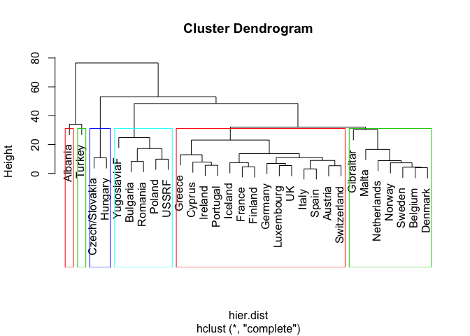<!-- -->

We compare our clusters with our EU group variable in the table below.
The rows denote the cluster solution and the columns denote the EU
group. Eastern European countries dominate the fourth cluster, EU and
EFTA make up cluster two, and the Other group is dispered among the 5
clusters. The six cluster solution has done a better job of bundeling
observations according to their group membership but we havent achieved
perfect classification accuracy.

``` r
# k = 6
cut.6 <- cutree(hclustmodel, k=6)
edataa<-cbind.data.frame(employment,cut.6)


ct.km <- table(employment$Group, edataa$cut.6)
ct.km
```

    ##          
    ##           1 2 3 4 5 6
    ##   Eastern 0 0 1 5 2 0
    ##   EFTA    2 4 0 0 0 0
    ##   EU      3 9 0 0 0 0
    ##   Other   2 1 0 0 0 1

#### Visualizing Hierarchical Cluster Analysis in Principal Component Space

To visualize our Hierarchical Clusters in one plot we use our Principal
Component coordinate system. The resulting scatterplot for the 3 and 6
cluster solutions are below.

``` r
pcdf3 <- cbind(pcdf2, cluster = as.factor(cut.3))
ggplot(pcdf3,aes(pc1,pc2))+ geom_point(aes(color = cluster), size=3)
```

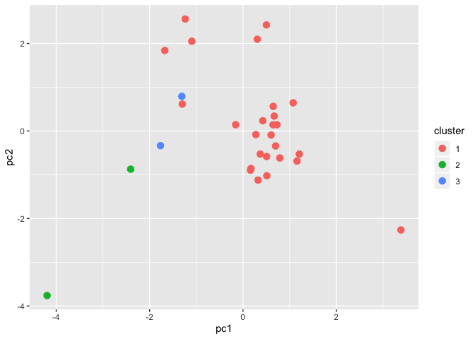<!-- -->

``` r
pcdf6 <- cbind(pcdf2,cluster = as.factor(cut.6))
ggplot(pcdf6,aes(pc1,pc2))+ geom_point(aes(color = cluster),size=3)
```

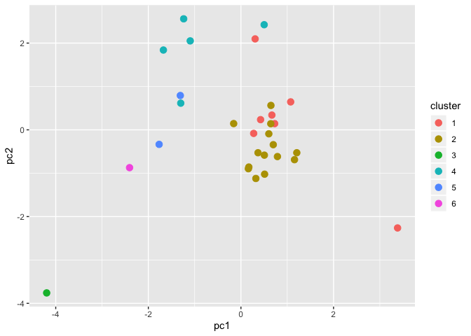<!-- -->
For our 3 cluster solution, it looks like cluster 1 has started to form
a real cluster in our PCA space. Its not as tightly clustered as we
would like which tell us that the first 2 principal components only
partially explains the first cluster. The other 2 clusters are not
captured by the principal components. Our 6 cluster solution does not
look any better in PCA space. Cluster 2 is densely clustered in the
PC1/PC2 coordinate system, the others are randomly dispersed.

### Evaluation of our Hierarchical Cluster Analysis

We evaluate our clusters using both internal measures focusing on the
cluster properties, and external measures which measures clusters
classification accuracy (as compared to the EU group variable).

#### Internal Cluster Evaluation

The goal of clustering algorithms is to split the dataset into clusters
of objects, such that they are:

*+* Compact: objects in the same cluster are similar as much as possible
(small average distance within clusters) *+* Seperate: objects in
different clusters are highly distinct (large average distance between
clusters)

We use the Dunn Index to measure compactness and Silhuette Analysis to
measure seperation.

##### Dunn Index

The Dunn Index divides the distance of objects between clusters by the
distance of objects within clusters (diameter). If the data set contains
compact and well-separated clusters, the diameter of the clusters is
expected to be small and the distance between the clusters is expected
to be large. Our Dunn Indeces tell us that our three cluster model
consists of more compact and well seperated clusters than our six
cluster model.

``` r
c3 <- eclust(employment[,-c(1,2)], "kmeans", k = 3,
                 nstart = 25, graph = FALSE)
c6 <- eclust(employment[,-c(1,2)], "kmeans", k = 6,
                 nstart = 25, graph = FALSE)
dunn3 <- cluster.stats(hier.dist,  c3$cluster)
dunn6 <- cluster.stats(hier.dist,  c6$cluster)
#dunn3$dunn
#dunn6$dunn
dunn <- matrix(c(0.5079199,0.2282364), ncol=2)
rownames(dunn) <- c('Dunn Index')
colnames(dunn) <- c('Heirarchical 3', 'Heirarchical 6')
dunn.table <- as.table(dunn)
formattable(dunn.table)
```

    ##            Heirarchical 3 Heirarchical 6
    ## Dunn Index 0.5079199      0.2282364

##### Silhuette Analysis

Silhouette analysis measures how well an observation is clustered and it
estimates the average distance between clusters. The silhouette plot
displays a measure of how close each point in one cluster is to points
in the neighboring clusters. Our three cluster solution has the larger
average distance between clusters and therefore has better more
seperated clusters than our six cluster solution.

``` r
# Silhouette coefficient of observations
sil3 <- silhouette(cut.3, dist(employment))
```

    ## Warning in dist(employment): NAs introduced by coercion

``` r
sil6 <- silhouette(cut.6, dist(employment))
```

    ## Warning in dist(employment): NAs introduced by coercion

``` r
# Silhouette plot
fviz_silhouette(sil3)
```

    ##   cluster size ave.sil.width
    ## 1       1   26          0.59
    ## 2       2    2          0.27
    ## 3       3    2          0.75

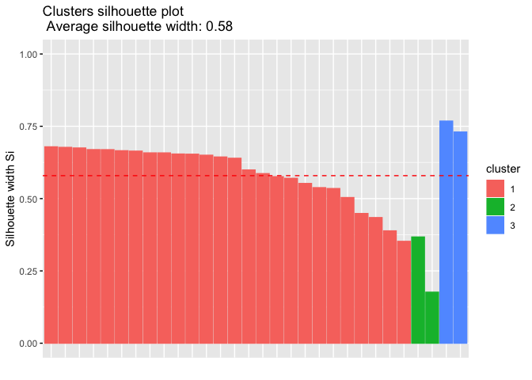<!-- -->

``` r
fviz_silhouette(sil6)
```

    ##   cluster size ave.sil.width
    ## 1       1    7          0.27
    ## 2       2   14          0.30
    ## 3       3    1          0.00
    ## 4       4    5          0.32
    ## 5       5    2          0.74
    ## 6       6    1          0.00

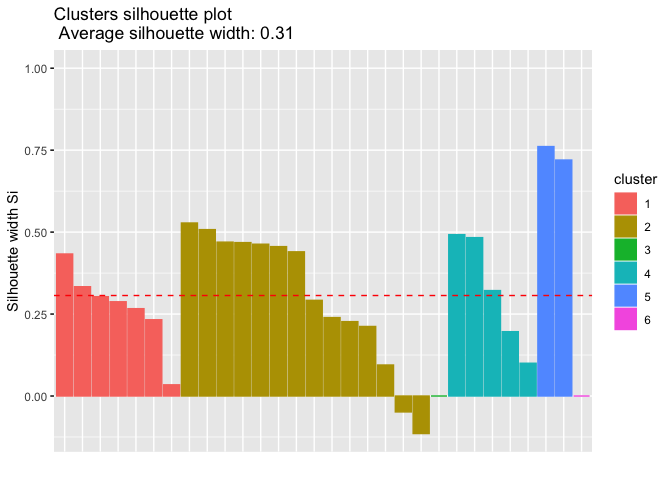<!-- -->

\#\#\#\#External Cluster Evaluation External Cluster Evaluation measures
are calculated by matching the structure of our cluster solutions with
the clusters formed by our EU group label. We the corrected Rand index
assess the similarity of the these two clustering structures.

\#\#\#\#\#Rand Index  
The Rand Index compares our predetermined country groupings to our
cluster results and tries to find the ratio of matching and unmatched
observations among the two cluster structures. It has a value between 0
and 1. The higher the value, better the score. Given the dendogram and
cross tables we looked at previously, Im surpised that our three cluster
solution has achieved a higher classification accuracy than our six
cluster solution.

``` r
# Compute cluster stats
group <- as.numeric(employment$Group)
stats3 <- cluster.stats(d = dist(employment), 
                             group, cut.6)
```

    ## Warning in dist(employment): NAs introduced by coercion

``` r
stats6 <- cluster.stats(d = dist(employment), 
                             group, cut.3)
```

    ## Warning in dist(employment): NAs introduced by coercion

``` r
#K=3
#stats3$corrected.rand
#stats3$vi
#K=6
#stats6$corrected.rand
stats6$vi
```

    ## [1] 1.454524

``` r
external <- matrix(c(0.2946571, 0.06355715), ncol=2)
rownames(external) <- c('Rand Index')
colnames(external) <- c('Heirarchical 3', 'Heirarchical 6')
external.table <- as.table(external)
formattable(external.table)
```

    ##            Heirarchical 3 Heirarchical 6
    ## Rand Index 0.29465710     0.06355715

## K-Means Clustering Analysis

The k-means algorithm is another method to cluster data. This technique
partitions the data set into unique homogeneous clusters whose
observations are similar to each other but different than other
clusters.

### K-Means Cluster Analysis where K=3

Unlike hierarchical clustering, k-means clustering requires that you
specify in advance the number of clusters to extract. We begin with an
analysis that uses K=3 clusters. Our solution gives us K-means
clustering with 3 clusters of sizes 20, 7, 3. Like with our 3 cluster
heirarchical model, most membership is mainly in cluster 1.

``` r
# kmeans clustering with k=3 clusters
clusterresults <- kmeans(employment[,-c(1,2)],3)
clusterresults
```

    ## K-means clustering with 3 clusters of sizes 3, 20, 7
    ## 
    ## Cluster means:
    ##        AGR       MIN      MAN    PS      CON       SER      FIN      SPS
    ## 1 27.86667 28.533333  0.00000 0.000 6.066667  8.933333 5.633333 16.73333
    ## 2  6.34500  0.385000 20.48000 0.885 7.930000 18.170000 8.390000 30.99500
    ## 3 22.15714  1.442857 28.42857 0.900 7.014286 11.271429 2.114286 19.95714
    ##         TC
    ## 1 6.233333
    ## 2 6.395000
    ## 3 6.714286
    ## 
    ## Clustering vector:
    ##  [1] 2 2 2 2 3 2 2 2 2 2 2 2 2 2 2 2 2 2 1 3 1 1 3 3 3 3 2 2 2 3
    ## 
    ## Within cluster sum of squares by cluster:
    ## [1] 1962.627 1891.014 1607.726
    ##  (between_SS / total_SS =  57.9 %)
    ## 
    ## Available components:
    ## 
    ## [1] "cluster"      "centers"      "totss"        "withinss"    
    ## [5] "tot.withinss" "betweenss"    "size"         "iter"        
    ## [9] "ifault"

We can compare the differences in means for our clusters among all
variables to start to identify the attributes of our groups.

Countries in Cluster 1 have: *+* highest percentage employed in
Agriculture and Mining *+* lowest percentage employed in Manufacturing,
Service, Power Supply Industries, Construction, and Social and Personal
services Countries in this cluster are probably not as industrial, they
probably have a lot of land space.

Countries in Cluster 2: *+* highest percentage employed of all other
clusters in Manufacturing, Power Supply Industries, Transport and
Communications *+* lowest percentage employed in Finance

Countries in Cluster 3: *+* highest percentage employed of all other
clusters in Construction, Service, Finance, and Social and Personal
services *+* lowest percentage employed in Agriculture and Mining
Countries in this cluster may have a lot of tourism, maybe a lot of
major cities.

The within cluster sum of squares by cluster (52.1 %) tells us the total
variance in our data that is explained by the clustering. Assigning our
observations to 3 clusters achieved a reduction in sums of squares of
52.1 %.

We look at a cross-tabulation of country group (EU, EFTA, Easter, Other)
and country cluster membership to get an idea for how well k-means
clustering uncovered the actual structure of the data contained in the
group variable.

``` r
ct.km <- table(employment$Group, clusterresults$cluster)
ct.km
```

    ##          
    ##            1  2  3
    ##   Eastern  3  0  5
    ##   EFTA     0  6  0
    ##   EU       0 11  1
    ##   Other    0  3  1

It looks like all the groups are combined into cluster 1 with the
exception of Eastern which is mostly in cluster 2. We need more clusters
to break up EFTA and the EU but from the results of our heirarchical
analysis it seems like the trade agreement countries (EU/EFTA) have
industry compositions that are more similar to one another, than the
within group variation of the other groups. The EU group labels may not
be an appropriate framework for understanding the differences in
industry compisition of European countries.

### K-Means Cluster Analysis where k=6

We use K-means cluster analysis to partition our data into 6 clusters.
Our solution gives us K-means clustering with 6 clusters of sizes 8, 9,
2, 4, 5, 2.

``` r
# kmeans clustering with k=6 clusters
cluster6 <- kmeans(employment[,-c(1,2)],6)
cluster6
```

    ## K-means clustering with 6 clusters of sizes 2, 5, 9, 8, 2, 4
    ## 
    ## Cluster means:
    ##        AGR        MIN      MAN        PS       CON      SER       FIN
    ## 1 14.05000 33.1000000  0.00000 0.0000000  7.400000 11.75000  0.800000
    ## 2 17.62000  1.7400000 32.90000 1.0200000  7.420000  9.66000  1.420000
    ## 3 11.42222  0.4222222 21.65556 0.6777778  8.611111 19.47778  6.955556
    ## 4  4.70000  0.3625000 20.17500 0.9625000  5.587500 15.40000  8.625000
    ## 5 50.15000 10.1500000  7.65000 0.1000000  4.300000  7.85000  8.850000
    ## 6  2.17500  0.3750000 18.12500 1.2250000 10.800000 20.77500 10.375000
    ##        SPS       TC
    ## 1 25.10000 7.850000
    ## 2 21.08000 7.140000
    ## 3 24.76667 5.988889
    ## 4 37.05000 7.125000
    ## 5  7.25000 3.700000
    ## 6 30.10000 5.975000
    ## 
    ## Clustering vector:
    ##  [1] 4 4 4 6 3 3 3 6 4 3 3 6 3 4 3 4 4 3 5 2 1 1 2 2 2 2 3 6 4 5
    ## 
    ## Within cluster sum of squares by cluster:
    ## [1]  57.9750 510.9360 442.7244 300.4712 577.7700 306.0325
    ##  (between_SS / total_SS =  83.1 %)
    ## 
    ## Available components:
    ## 
    ## [1] "cluster"      "centers"      "totss"        "withinss"    
    ## [5] "tot.withinss" "betweenss"    "size"         "iter"        
    ## [9] "ifault"

#### K-Means Clusters plotted in PCA Space

We plot our multivariate data on a 2 dimensional plot using Principal
Component Analysis with axis made up of the first two principal
components. This plot allows us to picture the size and shape of the
clusters, as well as their relative position. Objects belonging to
diferent clusters are plotted with diferent characters and shaded in
different colors. The axis have information about what percent of
variation is explain by each dimension. For both our K=3 and K=6
solutions plot only 54.68% of the point variability is explained by the
first two principal components. These plots are not exactly a faithful
representation of the four-dimensional data. The k-means clustering for
k = 6 is displayed in the left plot, the clusters in this plot are much
more compact than the k-means clustering for k=6 (right) indicate that
the six cluster solution is preferable to the three cluster solution.
You will see the clusters merged in the principal plane when clustering
is unsuccessful. This would add some insight into our low outcome of
just 54.68%, since the clusters are close together and overlapping.

``` r
library(cowplot)
```

    ## 
    ## ********************************************************

    ## Note: As of version 1.0.0, cowplot does not change the

    ##   default ggplot2 theme anymore. To recover the previous

    ##   behavior, execute:
    ##   theme_set(theme_cowplot())

    ## ********************************************************

``` r
kmean_calc <- function(df, ...){
  kmeans(df, scaled = ..., nstart = 30)
}
# cluster plots for kmeans

km3 <- kmean_calc(employment[,-c(1,2)], 3)
p2 <- fviz_cluster(km3, data = employment[,-c(1,2)], ellipse.type = "convex") + theme_minimal() + ggtitle("k = 3")

km6 <- kmeans(employment[,-c(1,2)], 6)
p6 <- fviz_cluster(km6, data = employment[,-c(1,2)], ellipse.type = "convex") + theme_minimal() + ggtitle("k = 6")
plot_grid(p2, p6, labels = c("k3", "k6"))
```

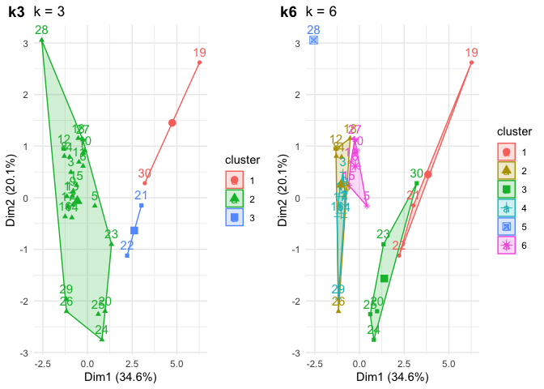<!-- -->

### Evaluation of cluster analysis

We compare our 3 cluster and 6 cluster solutions with internal measures
that focus on the cluster properties, and external measures which
compares our clusters to our labels (the group variable). \#\#\#\#
Internal Cluster Evaluation We use the Dunn Index to measure compactness
and Silhuette Analysis to measure seperation. \#\#\#\#\# Dunn Index

When we compare our two cluster solutions our three cluster model has
the higher dunn test and therefore consists of more compact and well
seperated clusters.

``` r
c3 <- eclust(employment[,-c(1,2)], "kmeans", k = 3,
                 nstart = 25, graph = FALSE)
c6 <- eclust(employment[,-c(1,2)], "kmeans", k = 6,
                 nstart = 25, graph = FALSE)
dunn3 <- cluster.stats(hier.dist,  c3$cluster)
dunn6 <- cluster.stats(hier.dist,  c6$cluster)
#dunn3$dunn
#dunn6$dunn
dunn <- matrix(c(0.5079199,0.2282364), ncol=2)
rownames(dunn) <- c('Dunn Index')
colnames(dunn) <- c('Heirarchical 3', 'Heirarchical 6')
dunn.table <- as.table(dunn)
formattable(dunn.table)
```

    ##            Heirarchical 3 Heirarchical 6
    ## Dunn Index 0.5079199      0.2282364

##### Silhuette Analysis

Silhouette analysis measures how well an observation is clustered and it
estimates the average distance between clusters. Our three cluster
solution has the larger average distance between clusters and therefore
has better more seperated clusters.

``` r
# Silhouette coefficient of observations
sil3 <- silhouette(cut.3, dist(employment))
```

    ## Warning in dist(employment): NAs introduced by coercion

``` r
sil6 <- silhouette(cut.6, dist(employment))
```

    ## Warning in dist(employment): NAs introduced by coercion

``` r
# Silhouette plot
fviz_silhouette(sil3)
```

    ##   cluster size ave.sil.width
    ## 1       1   26          0.59
    ## 2       2    2          0.27
    ## 3       3    2          0.75

<!-- -->

``` r
fviz_silhouette(sil6)
```

    ##   cluster size ave.sil.width
    ## 1       1    7          0.27
    ## 2       2   14          0.30
    ## 3       3    1          0.00
    ## 4       4    5          0.32
    ## 5       5    2          0.74
    ## 6       6    1          0.00

<!-- -->

#### External Cluster Evaluation

External Cluster Evaluation measures are calculated by matching the
structure of the clusters with our pre-defined classification of objects
, in our case the countries groupings (EU, EFTA, Eastern, Other).

##### Rand Index

Using the Rand Index we compare all four of our clustering solutions.
Agreement between the EU groups and the cluster solution is highest for
the Heirarchical Clustering Method using 3 clusters. Between the K-means
solutions, the K=3 solution performed better than the K=6 solution. This
is not to say the 3 cluster heirarchical or k means solutions are good.
I think we need to rethink the framework we are using to understand the
differences between these countries. Their industries dont seem to
cluster by the groups provided by the data.

``` r
# Compute cluster stats
group <- as.numeric(employment$Group)
clust_stats3 <- cluster.stats(d = dist(employment), 
                             group, clusterresults$cluster)
```

    ## Warning in dist(employment): NAs introduced by coercion

``` r
clust_stats6 <- cluster.stats(d = dist(employment), 
                             group, cluster6$cluster)
```

    ## Warning in dist(employment): NAs introduced by coercion

``` r
#K=3
#clust_stats3$corrected.rand
#K=6
#clust_stats6$corrected.rand

#heirarchical
#K=3
#stats3$corrected.rand
#K=6
stats6$corrected.rand
```

    ## [1] 0.06355715

``` r
trial <- matrix(c(0.2946571,0.06355715,0.272645,0.1864293), ncol=4)
rownames(trial) <- c('Rand Index')
colnames(trial) <- c('Heirarchical 3', 'Heirarchical 6', 'K-Means 3', 'K-Means 6')
trial.table <- as.table(trial)
formattable(trial.table)
```

    ##            Heirarchical 3 Heirarchical 6 K-Means 3  K-Means 6 
    ## Rand Index 0.29465710     0.06355715     0.27264500 0.18642930

## Optimal Number of Clusters

There are a number of indices for determining the best number of
clusters in a cluster analysis. Below are graphs showing the optimal
solution using:

*+* Total Sum of Square Method: to check for in-cluster similarity, the
*+* Average silhouette Width Method: which gives how well separated the
clusters are *+* Gap Statistic Method: compares the total within
intra-cluster variation for different values of k with their expected
values under null reference distribution of the data

``` r
e<-employment[,-c(1,2)]
#nc <- NbClust(e, distance="euclidean",
                  #min.nc=2, max.nc=20, method="complete")
#nc
# Elbow method
fviz_nbclust(e, kmeans, method = "wss") +
    geom_vline(xintercept = 4, linetype = 2)+
  labs(subtitle = "Elbow method")
```

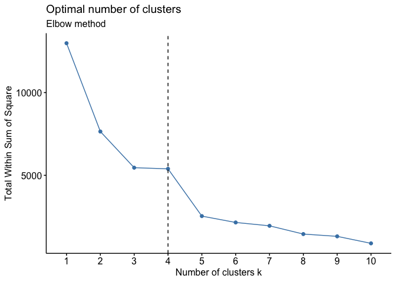<!-- -->

``` r
# Silhouette method
fviz_nbclust(e, kmeans, method = "silhouette")+
  labs(subtitle = "Silhouette method")
```

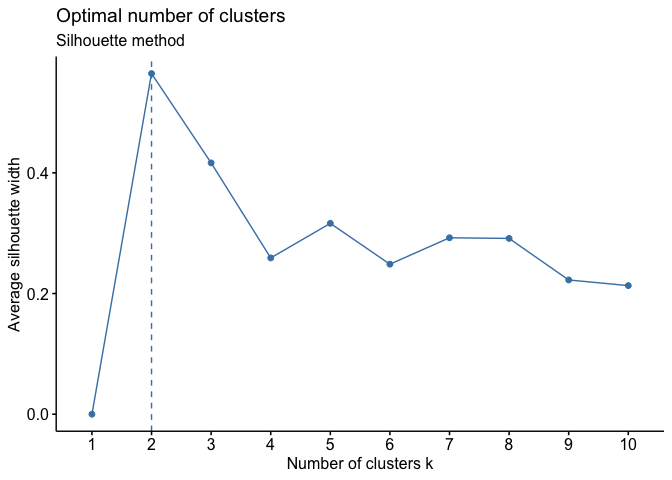<!-- -->

``` r
# Gap statistic
# nboot = 50 to keep the function speedy. 
# recommended value: nboot= 500 for your analysis.
# Use verbose = FALSE to hide computing progression.
set.seed(123)
fviz_nbclust(e, kmeans, nstart = 25,  method = "gap_stat", nboot = 50)+
  labs(subtitle = "Gap statistic method")
```

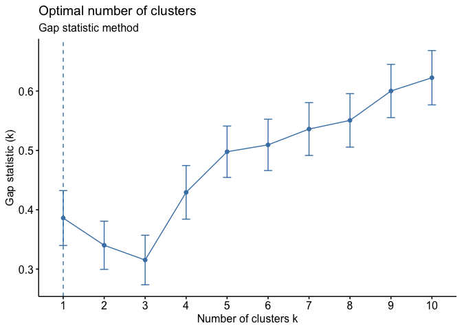<!-- -->

# USSTATES: Hierarchical Cluster Analysis

The second part of this project uses the USSTATES dataset. The data,
calculated from census data, consists of state-wide average or
proportion scores for the non-demographic variables. I use this data set
to conduct a hierarchical cluster analysis.

The USSTATES dataset is a 12 variable dataset with 50 records
representing the US States. Each row includes a group variable for
region that we can use as our framework for understanding how states
could be grouped. There are 2 continuous variables: population and
household income. The remaining variables are state-wide average or
proportion scores for various demographic variables. As such, higher
scores for the composite variables translate into having more of that
quality.

``` r
file.copy("~/Documents/USStates.csv", "raw_data")
```

    ## [1] FALSE

``` r
states <- read.csv("raw_data/USStates.csv")


print(states)
```

    ##             State Region Population HouseholdIncome HighSchool College
    ## 1         Alabama      S      4.849          43.253       84.9    24.9
    ## 2          Alaska      W      0.737          70.760       92.8    24.7
    ## 3         Arizona      W      6.731          49.774       85.6    25.5
    ## 4        Arkansas      S      2.966          40.768       87.1    22.4
    ## 5      California      W     38.803          61.094       84.1    31.4
    ## 6        Colorado      W      5.356          58.433       89.5    37.0
    ## 7     Connecticut     NE      3.597          69.461       91.0    39.8
    ## 8        Delaware     NE      0.936          59.878       86.9    31.7
    ## 9         Florida      S     19.893          46.956       87.1    26.5
    ## 10        Georgia      S     10.097          49.179       85.3    29.0
    ## 11         Hawaii      W      1.420          67.402       94.8    29.7
    ## 12          Idaho      W      1.634          46.767       89.9    23.6
    ## 13       Illinois     MW     12.881          56.797       89.8    38.2
    ## 14        Indiana     MW      6.597          48.248       87.6    27.5
    ## 15           Iowa     MW      3.107          51.843       92.4    32.2
    ## 16         Kansas     MW      2.904          51.332       89.6    33.1
    ## 17       Kentucky     MW      4.413          43.036       88.5    25.7
    ## 18      Louisiana      S      4.650          44.874       85.0    25.0
    ## 19          Maine     NE      1.330          48.453       94.0    29.9
    ## 20       Maryland     NE      5.976          73.538       89.5    39.4
    ## 21  Massachusetts     NE      6.745          66.866       92.4    48.3
    ## 22       Michigan     MW      9.910          48.411       90.0    29.2
    ## 23      Minnesota     MW      5.457          59.836       92.8    38.0
    ## 24    Mississippi      S      2.994          39.031       84.2    21.1
    ## 25       Missouri     MW      6.064          47.380       90.0    31.2
    ## 26        Montana      W      1.024          46.230       92.5    31.1
    ## 27       Nebraska     MW      1.882          51.672       90.1    33.3
    ## 28         Nevada      W      2.839          52.800       83.9    21.5
    ## 29  New Hampshire     NE      1.327          64.916       93.0    36.5
    ## 30     New Jersey     NE      8.938          71.629       90.7    41.5
    ## 31     New Mexico      W      2.086          44.927       84.0    21.4
    ## 32       New York     NE     19.746          58.003       88.4    41.9
    ## 33 North Carolina      S      9.944          46.334       85.8    30.2
    ## 34   North Dakota     MW      0.739          53.741       95.4    33.9
    ## 35           Ohio     MW     11.594          48.308       90.3    30.3
    ## 36       Oklahoma      S      3.878          45.339       87.3    24.6
    ## 37         Oregon      W      3.970          50.229       88.7    30.1
    ## 38   Pennsylvania     NE     12.787          52.548       91.4    35.7
    ## 39   Rhode Island     NE      1.055          56.361       89.3    35.7
    ## 40 South Carolina      S      4.832          44.779       86.3    27.3
    ## 41   South Dakota     MW      0.853          49.495       92.2    29.1
    ## 42      Tennessee      S      6.549          44.298       88.6    27.5
    ## 43          Texas      S     26.957          51.900       83.8    26.9
    ## 44           Utah      W      2.943          58.821       91.2    29.9
    ## 45        Vermont     NE      0.627          54.267       93.4    37.2
    ## 46       Virginia      S      8.326          63.907       90.8    38.9
    ## 47     Washington      W      7.062          59.478       89.5    31.9
    ## 48  West Virginia      S      1.850          41.043       90.2    23.2
    ## 49      Wisconsin     MW      5.758          52.413       91.7    31.2
    ## 50        Wyoming      W      0.584          57.406       92.7    25.7
    ##    Smokers PhysicalActivity Obese NonWhite HeavyDrinkers TwoParents
    ## 1     21.5             45.4  32.4     30.7           4.3       58.7
    ## 2     22.6             55.3  28.4     33.1           8.2       69.6
    ## 3     16.3             51.9  26.8     20.8           6.3       62.7
    ## 4     25.9             41.2  34.6     21.7           5.0       62.0
    ## 5     12.5             56.3  24.1     37.7           6.4       65.3
    ## 6     17.7             60.4  21.3     15.8           6.7       69.9
    ## 7     15.5             50.9  25.0     22.1           6.3       67.0
    ## 8     19.6             49.7  31.1     30.0           6.6       60.4
    ## 9     16.8             50.2  26.4     23.7           7.2       60.2
    ## 10    18.8             50.8  30.3     39.4           4.7       60.3
    ## 11    13.3             60.2  21.8     75.0           7.6       70.4
    ## 12    17.2             53.9  29.6      8.1           6.2       74.1
    ## 13    18.0             52.4  29.4     27.5           6.5       66.2
    ## 14    21.9             44.1  31.8     15.4           5.2       65.4
    ## 15    19.5             47.0  31.3      8.5           6.5       69.6
    ## 16    20.0             49.1  30.0     14.6           4.6       70.0
    ## 17    26.5             46.0  33.2     12.1           4.9       64.3
    ## 18    23.5             45.2  33.1     37.1           6.3       54.1
    ## 19    20.2             53.6  28.9      4.8           7.2       66.1
    ## 20    16.4             48.6  28.3     41.6           5.2       63.7
    ## 21    16.6             54.5  23.6     19.5           7.5       67.6
    ## 22    21.4             53.1  31.5     20.7           6.3       64.1
    ## 23    18.0             52.7  25.5     14.4           7.3       71.2
    ## 24    24.8             37.4  35.1     40.5           4.2       52.3
    ## 25    22.1             48.7  30.4     17.0           6.0       65.5
    ## 26    19.0             57.8  24.6     10.6           7.7       67.0
    ## 27    18.5             50.1  29.6     11.8           6.8       70.5
    ## 28    19.4             53.6  26.2     28.6           7.1       62.7
    ## 29    16.2             55.4  26.7      6.0           6.5       69.6
    ## 30    15.7             50.5  26.3     30.8           5.0       69.2
    ## 31    19.1             55.0  26.4     27.0           5.9       56.6
    ## 32    16.6             47.3  25.4     34.4           6.0       64.2
    ## 33    20.3             48.6  29.4     30.3           4.9       61.9
    ## 34    21.2             45.3  31.0     10.4           7.2       72.5
    ## 35    23.4             49.5  30.4     17.1           5.7       63.4
    ## 36    23.7             43.9  32.5     26.5           4.2       64.4
    ## 37    17.3             64.1  26.5     14.8           8.6       69.0
    ## 38    21.0             47.8  30.0     17.8           5.9       65.1
    ## 39    17.4             49.1  27.3     18.6           6.1       59.1
    ## 40    22.0             49.1  31.7     32.8           5.7       58.3
    ## 41    19.6             53.7  29.9     14.4           5.2       67.5
    ## 42    24.3             37.7  33.7     21.8           3.3       62.1
    ## 43    15.9             42.1  30.9     25.6           5.9       64.4
    ## 44    10.3             55.3  24.1     11.6           4.5       80.6
    ## 45    16.6             58.8  24.7      4.8           7.1       67.1
    ## 46    19.0             51.9  27.2     30.5           5.7       67.9
    ## 47    16.1             56.3  27.2     21.5           6.6       69.7
    ## 48    27.3             47.6  35.1      6.2           3.9       62.8
    ## 49    18.7             53.4  29.8     13.0           7.8       68.6
    ## 50    20.6             54.2  27.8      9.1           5.8       71.3
    ##    Insured
    ## 1     78.8
    ## 2     79.8
    ## 3     74.7
    ## 4     71.7
    ## 5     79.7
    ## 6     80.0
    ## 7     87.7
    ## 8     85.7
    ## 9     70.9
    ## 10    72.7
    ## 11    90.0
    ## 12    75.9
    ## 13    80.6
    ## 14    79.1
    ## 15    87.3
    ## 16    79.2
    ## 17    78.0
    ## 18    74.0
    ## 19    84.7
    ## 20    84.5
    ## 21    92.8
    ## 22    82.6
    ## 23    87.1
    ## 24    71.9
    ## 25    81.2
    ## 26    78.5
    ## 27    82.4
    ## 28    72.7
    ## 29    84.4
    ## 30    80.7
    ## 31    73.8
    ## 32    83.0
    ## 33    75.8
    ## 34    87.6
    ## 35    83.3
    ## 36    77.4
    ## 37    75.0
    ## 38    84.8
    ## 39    81.3
    ## 40    76.1
    ## 41    85.1
    ## 42    78.8
    ## 43    67.3
    ## 44    80.8
    ## 45    88.5
    ## 46    81.6
    ## 47    79.4
    ## 48    76.3
    ## 49    85.8
    ## 50    76.4

Were going to focus on the composite variables and so we create a new
dataframe only containing those variables. Since the composite variables
are all measured in the same units we do not need to scale our
variables.

### Heirarchical Clustering

We measure the dissimilarity of observations using Euclidean distance
and then use complete linkage clustering to produce our clusters. In the
dendogram below, the Southern states look like theyre close to one
another forming one cluster, so do the Western states. The Midwest and
Eastern states seem to be similar to one other. Hawaii and Utah are
outliers.

``` r
hier.distt = dist(scale(states[,-c(1,2,3,4)]))
require(maptree)
statesmodel <- hclust(hier.distt, method = 'complete')
plot(statesmodel,labels=states$State)
```

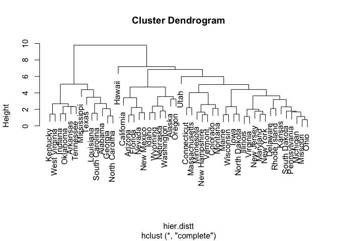<!-- -->
\#\#\# How many clusters to use

Its not clear from the dendogram where to cut our clusters so we use the
elbow method. The elbow method looks at the percentage of variance
explained as a function of the number of clusters. We choose a number of
clusters so that adding another cluster doesn’t give much better
modeling of the data. We want to choose the point where the marginal
gain will drop, giving an angle in the graph. We will use three
clusters.

``` r
subdat <- states[,-c(1,2,3,4)]
wssplot <- function(subdat, nc=15, seed=1234) {
  wss <- (nrow(subdat)-1)*sum(apply(subdat,2,var))
  for (i in 2:nc) {
    require(fpc)
    set.seed(seed)
    hier.dist <- dist(subdat)
    complete3 <- cutree(hclust(hier.dist),i)
  wss[i] <- cluster.stats(hier.dist,complete3, alt.clustering=NULL)$within.cluster.ss}
  rs <- (wss[1] - wss)/wss[1]
    plot(1:nc, wss, type="b", xlab="Number of Clusters",
       ylab="Within groups sum of squares")
    plot(1:nc, rs, type="b", xlab="Number of Clusters",
         ylab="% of Between SS")
    return(wss)}

wssplot(subdat)
```

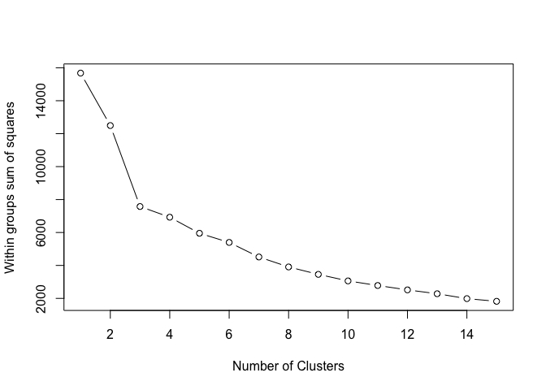<!-- -->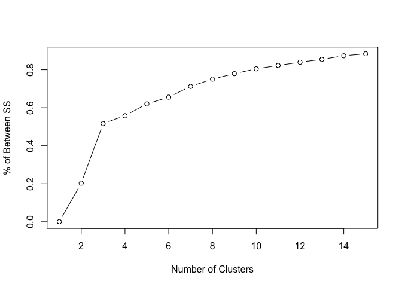<!-- -->

    ##  [1] 15677.620 12492.548  7577.116  6927.917  5952.766  5397.272  4512.980
    ##  [8]  3908.216  3458.040  3060.887  2782.146  2515.738  2282.131  1984.855
    ## [15]  1821.795

### Hierarchical Clustering with 3 clusters

``` r
plot(statesmodel,labels=states$State)
rect.hclust(statesmodel,k=3, border = 2:5)
```

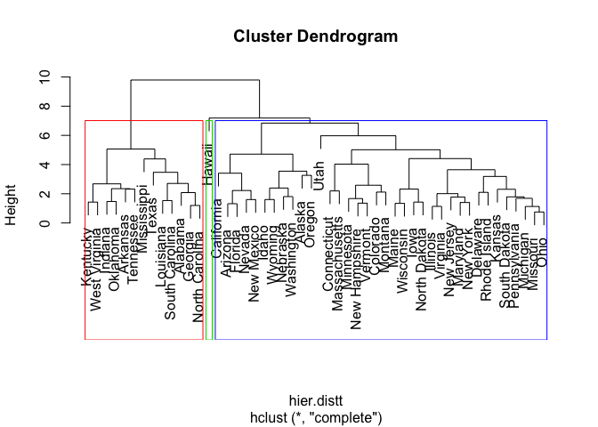<!-- -->

``` r
# choose the number of clusters k = 5
cut3 <- cutree(statesmodel, k=3)
s<-cbind.data.frame(states,cut3)


ct.km <- table(states$Region, s$cut3)
ct.km
```

    ##     
    ##       1  2  3
    ##   MW  2 11  0
    ##   NE  0 11  0
    ##   S  11  2  0
    ##   W   0 12  1

Southern states have formed their own cluster while the other states are
grouped into cluster 2. Hawaii our outlier forms its own cluster,
cluster 3. We will try again with more clusters.

### Hierarchical Clustering with 5 Clusters

``` r
plot(statesmodel,labels=states$State)
rect.hclust(statesmodel,k=5, border = 2:5)
```

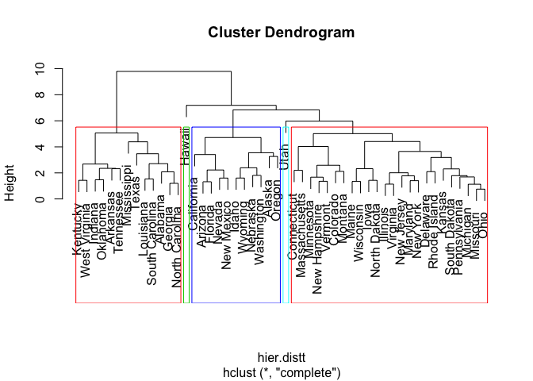<!-- -->

``` r
# choose the number of clusters k = 5
cut5 <- cutree(statesmodel, k=5)
s<-cbind.data.frame(states,cut5)


ct.km <- table(states$Region, s$cut5)
ct.km
```

    ##     
    ##       1  2  3  4  5
    ##   MW  2  1 10  0  0
    ##   NE  0  0 11  0  0
    ##   S  11  1  1  0  0
    ##   W   0  9  2  1  1

Cluster 1: Southern States Cluster 2: Western States Cluster 3: MW NE
states Clusters 4: outlier Cluster 5: outlier

We have succesfully created sepearate clusters for the Southern and
Wester States but we have two clusters that only hold one state and our
MW and NE regions are still combined in cluster 3.

#### Visualizing our Hierarchical Clusters in Principal Component Space

We visualize our high dimensional data in one plot using Principal
Component Analysis. Our plot shows three very loose overlapping
clusters. Cluster 1 is high on the map, cluster 2 is in the middle,
cluster 4 is low. Clusters 3 and 5 show no pattern.

``` r
apply(states[,-c(1,2)],MARGIN=1,FUN=sum)
```

    ##  [1] 429.702 485.997 427.105 415.334 497.397 462.089 478.358 462.514
    ##  [9] 435.849 450.576 531.622 426.901 478.278 432.845 449.250 444.436
    ## [17] 426.649 432.824 439.183 496.714 496.411 457.221 472.293 413.525
    ## [25] 445.544 436.054 446.654 431.339 460.543 490.967 416.213 484.949
    ## [33] 443.478 458.980 453.302 433.717 448.299 464.835 441.316 438.911
    ## [41] 447.048 428.647 441.657 450.064 453.094 485.733 464.740 415.493
    ## [49] 458.171 441.590

``` r
pca.outt <- princomp(x=states[,-c(1,2)],cor=FALSE);


pc.1 <- pca.outt$scores[,1];
pc.2 <- pca.outt$scores[,2];

pcdff = data.frame(pc1=pc.1, pc2=pc.2)
pcdff1 = cbind(pcdff,states$State)
pcdff2 = cbind(pcdff1,states$Region)


pcdff3 <- cbind(pcdff2,cluster = as.factor(cut5))
ggplot(pcdff3,aes(pc1,pc2))+ geom_point(aes(color = cluster), size=3)
```

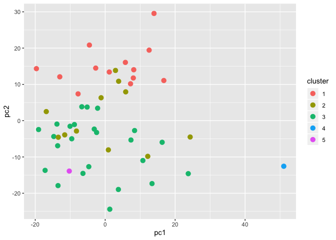<!-- -->

### Evaluation of our Hierarchical Cluster Analysis

We evaluate our clusters with internal measures that focus on the
cluster properties, and external measures which compares our clusters to
our region variable.

\#\#\#\#Internal Cluster Evaluation

We use the Dunn Index to measure compactness and Silhuette Analysis to
measure seperation.

##### Compactness: Dunn Index

Our Dunn index is pretty low, as we saw in out PCA graph, the clusters
are not very tight and compact.

``` r
c6 <- eclust(subdat, "kmeans", k = 5,
                 nstart = 25, graph = FALSE)


dunn6 <- cluster.stats(hier.distt,  c6$cluster)

dunn6$dunn
```

    ## [1] 0.212174

``` r
dunn <- matrix(c(0.212174), ncol=1)
rownames(dunn) <- c('Dunn Index')
colnames(dunn) <- c('Heirarchical 5')
dunn.table <- as.table(dunn)
formattable(dunn.table)
```

    ##            Heirarchical 5
    ## Dunn Index 0.212174

##### Seperateness: Silhuette Analysis

Our average silhuette width is low between clusters. Objects with a low
silhouette value are considered poorly clustered.

``` r
# Silhouette coefficient of observations
sil5 <- silhouette(cut5, hier.distt)
# Silhouette plot
fviz_silhouette(sil5)
```

    ##   cluster size ave.sil.width
    ## 1       1   13          0.34
    ## 2       2   11          0.08
    ## 3       3   24          0.21
    ## 4       4    1          0.00
    ## 5       5    1          0.00

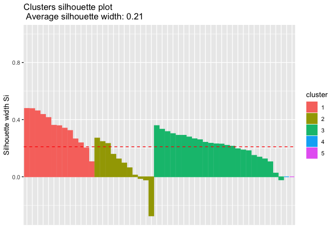<!-- -->
\#\#\#\# External Cluster Evaluation External Cluster Evaluation
measures are calculated by matching the structure of the clusters with
our region labels.

##### Rand Index

Agreement between the groups and the cluster solution is 0.2396616 for
the Heirarchial Clustering Method using 5 clusters. This is a low score.

``` r
# Compute cluster stats
group <- as.numeric(states$Region)
clust <- cluster.stats(d = hier.distt, 
                             group, c6$cluster)

#K=3
#clust$corrected.rand
#K=6
#clust_stats6$corrected.rand

#heirarchical
#K=3
#stats3$corrected.rand
#K=6


trial <- matrix(c(0.2396616), ncol=1)
rownames(trial) <- c('Rand Index')
colnames(trial) <- c('Heirarchical 5')
trial.table <- as.table(trial)
formattable(trial.table)
```

    ##            Heirarchical 5
    ## Rand Index 0.2396616

# RECIDIVISM: PAM Cluster Analysis

The final part of this project uses the RECIDIVISM dataset. The data
consists of a random sample records on convicts released from prison
during 1977/1978. I use this data set to conduct a k-means cluster
analysis.

The recidivism dataset is an 18 variable dataset with 1445 records. The
data is a random sample of convicts released from prison between July 1,
1977 and June 30, 1978. The information was collected retrospectively by
looking at records in April 1984, so the maximum possible length of
observation is 81 months.

``` r
head(recid)
```

    ##   black alcohol drugs super married felon workprg property person priors
    ## 1     0       1     0     1       1     0       1        0      0      0
    ## 2     1       0     0     1       0     1       1        1      0      0
    ## 3     0       0     0     0       0     0       1        1      0      0
    ## 4     0       0     1     1       0     1       1        1      0      2
    ## 5     0       0     1     1       0     0       0        0      0      0
    ## 6     1       0     0     1       0     0       1        0      0      1
    ##   educ rules age tserved follow durat cens   ldurat
    ## 1    7     2 441      30     72    72    1 4.276666
    ## 2   12     0 307      19     75    75    1 4.317488
    ## 3    9     5 262      27     81     9    0 2.197225
    ## 4    9     3 253      38     76    25    0 3.218876
    ## 5    9     0 244       4     81    81    1 4.394449
    ## 6   12     0 277      13     79    79    1 4.369448

The variables are a mix of binary variables and continuous variables.
Since K-Means uses centroids (a vector of variable means) and Euclidean
distance to measure proximity, it requires that all variables be
continuous. Partitioning around medoids (PAM) unlike K-means can be
based on any distance measure and can therefore accommodate mixed data
types and isn’t limited to continuous variables. With PAM, rather than
representing each cluster using a centroid, each cluster is identified
by its most representative observation

### Distance Measure

In order for a clustering algorithm to yield sensible results, we have
to use a distance metric that can handle mixed data types. In this case,
we will use something called Gower distance. For each variable type, the
distance metric that works well for that type is used and scaled to fall
between 0 and 1. Our quantitative variables use a range-normalized
Manhattan distance. Our binary variables use a Dice coefficient.

``` r
r<-recid[,-c(18)]
dist <- daisy(r,
                    metric = "gower",
                    type = list(logratio = 3))
```

    ## Warning in daisy(r, metric = "gower", type = list(logratio = 3)): binary
    ## variable(s) 1, 2, 3, 4, 5, 6, 7, 8, 9, 17 treated as interval scaled

``` r
summary(dist)
```

    ## 1043290 dissimilarities, summarized :
    ##      Min.   1st Qu.    Median      Mean   3rd Qu.      Max. 
    ## 0.0001701 0.2216300 0.2968400 0.2991400 0.3747700 0.7514100 
    ## Metric :  mixed ;  Types = I, I, I, I, I, I, I, I, I, I, I, I, I, I, I, I, I 
    ## Number of objects : 1445

### Selecting the number of clusters

We use silhouette width, an internal validation metric which measures
how similar an observation is to its own cluster compared its closest
neighboring cluster. The metric can range from -1 to 1, where higher
values are better. After calculating silhouette width for clusters
ranging from 2 to 10 for the PAM algorithm, we see that 7 clusters
yields the highest value.

``` r
sil_width <- c(NA)

for(i in 2:10){
  
  pam_fit <- pam(dist,
                 diss = TRUE,
                 k = i)
  
  sil_width[i] <- pam_fit$silinfo$avg.width
  
}

# Plot sihouette width (higher is better)

plot(1:10, sil_width,
     xlab = "Number of clusters",
     ylab = "Silhouette Width")
lines(1:10, sil_width)
```

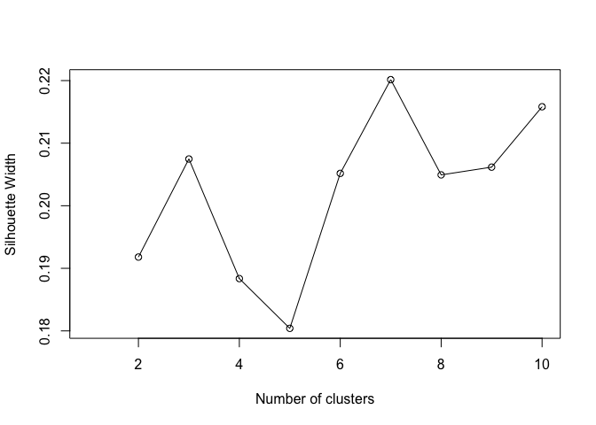<!-- -->
\#\#\# Cluster Interpretation After running the algorithm and selecting
seven clusters, we can interpret the clusters by running summary on each
cluster. Based on these results:

*+* All the clusters have similar levels of education, age, drug use and
alcohol use *+* There was a lot of variation between clusters when it
came to time served and duration *+* Cluster 1 is blacker and more
married *+* Cluster 4 is blacker and higher felony *+* Clusters 6 and 7
have high priors

### Visualization

One way to visualize many variables in a lower dimensional space is with
t-distributed stochastic neighborhood embedding, or t-SNE. This method
is a dimension reduction technique that tries to preserve local
structure so as to make clusters visible in a 2D or 3D visualization. In
this case, the plot shows that PAM was able to detect a couple decently
seperated but not very compact clusters.

## 9\. Reflection

I think I need to get more comfortable evaluating and adjusting the
cluster algorithms. I often got poor results but was unsure about how to
proceed. I was also confused about why the Rand index never matched the
classification accuracy in my cross tables. When it came to
interpretation I found using K-means clustering on the European to be
the easiest and the PAM clustering on recidivism to be the most
difficult. The recidivism data was also hard to use because there was no
variable that served as a label so it felt very vague, its hard not to
be able to rely on some assumptions about the data.
